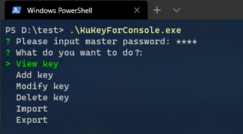

# KuKeyForConsole

### Instructions for use

1. Run the binary

### Screenshot

### Features

* Opensource
* No internet connection
* AES encryption
* Full platform

### Supported platforms

* Linux

* Windows

* Mac os